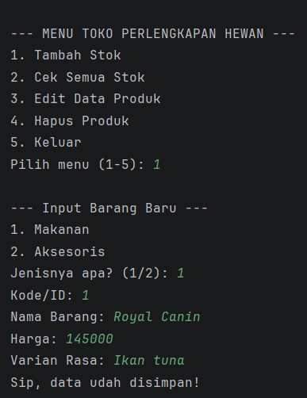
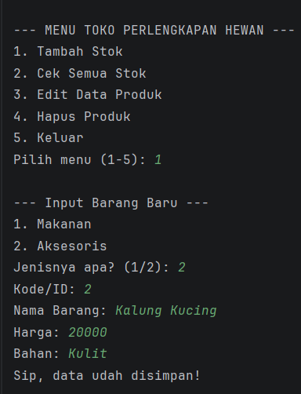
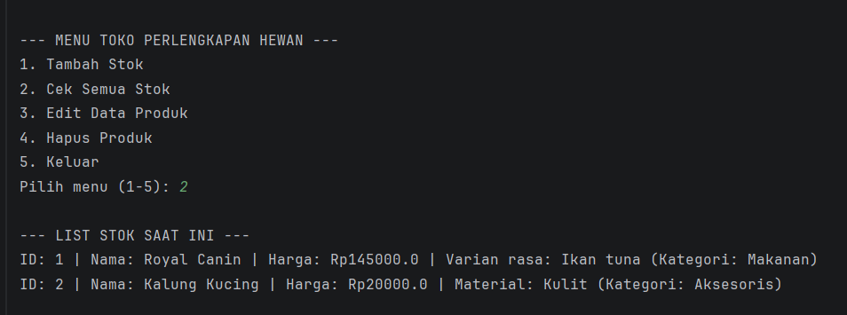
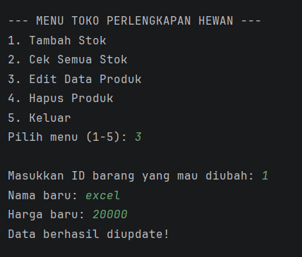
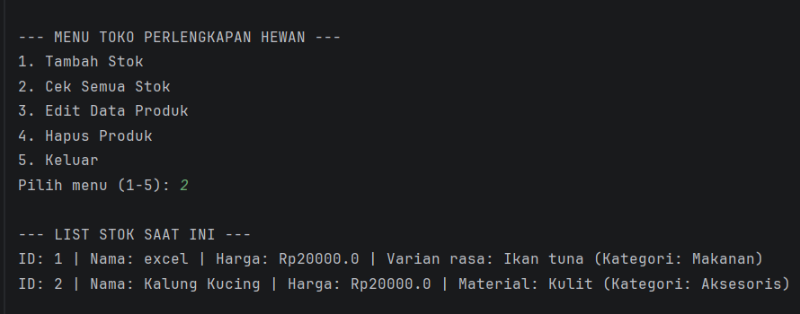
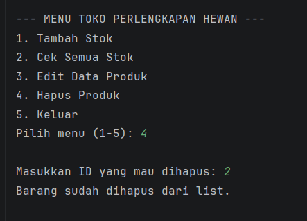
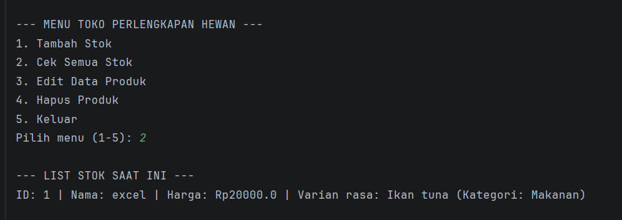
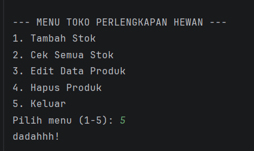
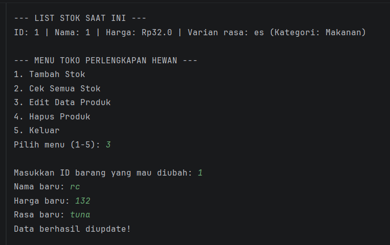

# Laporan Praktikum PBO - Posttest 1

Nabila Putri Karni
2409106041 
Sistem Penjualan Perlengkapan Hewan (Pet Shop)

## Deskripsi Program
Program ini adalah aplikasi manajemen stok sederhana untuk sebuah Pet Shop yang dibuat menggunakan bahasa pemrograman Java. Program ini menerapkan konsep dasar Pemrograman Berorientasi Objek (PBO) sesuai dengan yang diajarkan pada Modul 1 dan Modul 2, yaitu pengelolaan data menggunakan `ArrayList` dan pengorganisasian kode melalui `Class`.

Inti dari program ini adalah memudahkan admin toko untuk melakukan CRUD (Create, Read, Update, Delete) pada barang-barang seperti makanan kucing atau aksesoris hewan secara digital.

## Struktur Class 
Dalam program ini, terdapat beberapa class yaitu:

1. Class Produk: Sebagai induk (Parent Class) yang menyimpan atribut umum seperti ID, Nama, dan Harga.
2. Class MakananHewan: Child Class yang mewarisi sifat dari Produk dengan tambahan atribut spesifik yaitu `rasa`.
3. Class Aksesoris: Child Class yang mewarisi sifat dari Produk dengan tambahan atribut spesifik yaitu `material`.

## Fitur Program 
Program dijalankan secara berulang (looping) menggunakan menu interaktif:
1. Tambah Stok (Create): Memasukkan data barang baru ke gudang.
2. Cek Semua Stok (Read): Menampilkan semua daftar barang yang sudah di input.
3. Edit Data Produk (Update): Mengubah nama atau harga barang kalau ada kesalahan, cukup dengan mencari IDnya.
4. Hapus Produk (Delete): Menghapus barang yang sudah tidak dijual lagi dari sistem.

## Implementasi ArrayList
Program ini menggunakan `ArrayList` sebagai media penyimpanan dinamis. Operasi yang digunakan meliputi:
- `add()`: Untuk memasukkan barang baru ke dalam list.
- `size()` & `get()`: Untuk melakukan perulangan saat menampilkan data.
- `remove()`: Untuk menghapus data dari list.
- `isEmpty()`: Untuk memvalidasi apakah stok masih kosong atau sudah terisi.

## Cara Menjalankan Program
1. Pastikan komputer sudah terinstal JDK (versi 25 direkomendasikan).
2. Buka proyek melalui IntelliJ IDEA.
3. Jalankan file `Main.java`.
4. Ikuti instruksi menu yang muncul pada terminal/console.

## Screenshot Output

1. 
2. 
3. 
4. 
5. 
6. 
7. 
8. 

# Posttest 2: Encapsulation
Pada tahap ini, dilakukan implementasi Encapsulation untuk meningkatkan keamanan data dengan membatasi akses langsung ke atribut objek.

## 1. Access Modifiers
Private: Diterapkan pada semua atribut (ID, Nama, Harga, Rasa, Material). Data kini terlindungi dan tidak bisa diakses langsung dari luar class.
Public: Digunakan pada constructor dan method (Getter/Setter) sebagai akses resmi untuk mengelola data.

## 2. Getter dan Setter
Program kini menggunakan metode "pintu masuk" untuk interaksi data:
Getter: Mengambil nilai atribut (contoh: getId()).
Setter: Mengubah nilai atribut (contoh: setHarga()). Digunakan pada fitur Update untuk memvalidasi perubahan data secara aman.

## 3. Perubahan Struktur Class
Produk (Parent): Atribut diubah menjadi private, dilengkapi Getter dan Setter.
MakananHewan & Aksesoris (Child): Memiliki atribut spesifik private serta metode aksesnya sendiri.
Main: Logika CRUD diperbarui menggunakan metode Setter, serta penambahan casting objek untuk mengedit atribut khusus (Rasa/Material).

## Screenshot Output
1. 

