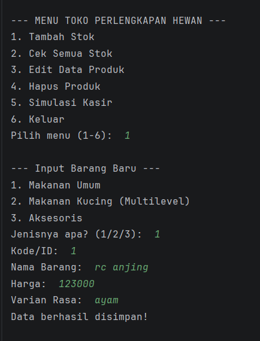
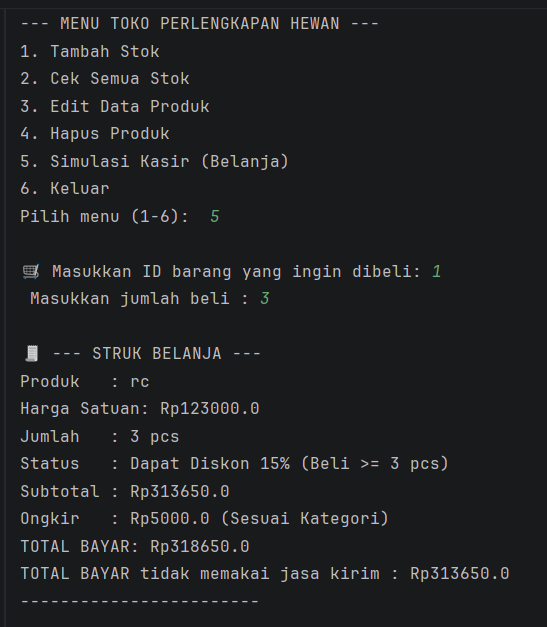

# Laporan Praktikum PBO - Posttest 1

Nabila Putri Karni
2409106041 
Sistem Penjualan Perlengkapan Hewan (Pet Shop)

## Deskripsi Program
Program ini adalah aplikasi manajemen stok sederhana untuk sebuah Pet Shop yang dibuat menggunakan bahasa pemrograman Java. Program ini menerapkan konsep dasar Pemrograman Berorientasi Objek (PBO) sesuai dengan yang diajarkan pada Modul 1 dan Modul 2, yaitu pengelolaan data menggunakan `ArrayList` dan pengorganisasian kode melalui `Class`.

Inti dari program ini adalah memudahkan admin toko untuk melakukan CRUD (Create, Read, Update, Delete) pada barang-barang seperti makanan kucing atau aksesoris hewan secara digital.

## Struktur Class 
Dalam program ini, terdapat beberapa class yaitu:

1. Class Produk: Sebagai induk (Parent Class) yang menyimpan atribut umum seperti ID, Nama, dan Harga.
2. Class MakananHewan: Child Class yang mewarisi sifat dari Produk dengan tambahan atribut spesifik yaitu `rasa`.
3. Class Aksesoris: Child Class yang mewarisi sifat dari Produk dengan tambahan atribut spesifik yaitu `material`.

## Fitur Program 
Program dijalankan secara berulang (looping) menggunakan menu interaktif:
1. Tambah Stok (Create): Memasukkan data barang baru ke gudang.
2. Cek Semua Stok (Read): Menampilkan semua daftar barang yang sudah di input.
3. Edit Data Produk (Update): Mengubah nama atau harga barang kalau ada kesalahan, cukup dengan mencari IDnya.
4. Hapus Produk (Delete): Menghapus barang yang sudah tidak dijual lagi dari sistem.

## Implementasi ArrayList
Program ini menggunakan `ArrayList` sebagai media penyimpanan dinamis. Operasi yang digunakan meliputi:
- `add()`: Untuk memasukkan barang baru ke dalam list.
- `size()` & `get()`: Untuk melakukan perulangan saat menampilkan data.
- `remove()`: Untuk menghapus data dari list.
- `isEmpty()`: Untuk memvalidasi apakah stok masih kosong atau sudah terisi.

## Cara Menjalankan Program
1. Pastikan komputer sudah terinstal JDK (versi 25 direkomendasikan).
2. Buka proyek melalui IntelliJ IDEA.
3. Jalankan file `Main.java`.
4. Ikuti instruksi menu yang muncul pada terminal/console.

## Screenshot Output

1. 
2. 
3. 
4. 
5. 
6. 
7. 
8. 

# Posttest 2: Encapsulation
Pada tahap ini, dilakukan implementasi Encapsulation untuk meningkatkan keamanan data dengan membatasi akses langsung ke atribut objek.

## 1. Access Modifiers
Private: Diterapkan pada semua atribut (ID, Nama, Harga, Rasa, Material). Data kini terlindungi dan tidak bisa diakses langsung dari luar class.
Public: Digunakan pada constructor dan method (Getter/Setter) sebagai akses resmi untuk mengelola data.

## 2. Getter dan Setter
Program kini menggunakan metode "pintu masuk" untuk interaksi data:
Getter: Mengambil nilai atribut (contoh: getId()).
Setter: Mengubah nilai atribut (contoh: setHarga()). Digunakan pada fitur Update untuk memvalidasi perubahan data secara aman.

## 3. Perubahan Struktur Class
Produk (Parent): Atribut diubah menjadi private, dilengkapi Getter dan Setter.
MakananHewan & Aksesoris (Child): Memiliki atribut spesifik private serta metode aksesnya sendiri.
Main: Logika CRUD diperbarui menggunakan metode Setter, serta penambahan casting objek untuk mengedit atribut khusus (Rasa/Material).

## Screenshot Output
Saat mengedit maka varian rasa juga bisa dirubah 
1. 

# Posttest 3: Inheritance
Berdasarkan Modul 4, program ini menerapkan dua jenis inheritance:
Hierarchical Inheritance: Class Produk bertindak sebagai Superclass yang diwarisi oleh dua Subclass berbeda, yaitu MakananHewan dan Aksesoris.

Multilevel Inheritance: Class MakananKucing mewarisi Class MakananHewan, yang mana MakananHewan sendiri adalah turunan dari Produk. Ini membentuk hirarki berjenjang: Produk -> MakananHewan -> MakananKucing.

## Daftar Class:

Class Produk (Superclass): Menyimpan atribut dasar semua barang (ID, Nama, Harga). Menggunakan access modifier protected agar atribut dapat diakses langsung oleh subclass-nya.

Class MakananHewan (Subclass): Menambahkan atribut spesifik rasa.

Class MakananKucing (Subclass dari MakananHewan): Menambahkan atribut spesifik jenis (seperti Basah atau Kering).

Class Aksesoris (Subclass): Menambahkan atribut spesifik material.

## Implementasi Konsep Modul 4

Relasi Is-A:

MakananHewan is-a Produk.

Aksesoris is-a Produk.

MakananKucing is-a MakananHewan.

Keyword extends: Digunakan pada deklarasi class untuk menghubungkan subclass dengan superclass-nya.

Keyword super:

- super() digunakan pada constructor subclass untuk menginisialisasi atribut yang ada di superclass.

- super.tampilkanData() digunakan untuk memanggil fungsi cetak data dari parent class sebelum menambahkan informasi spesifik subclass (Method Overriding).

Method Overriding: Subclass menulis ulang method tampilkanData() untuk menyesuaikan informasi yang ditampilkan sesuai kategori produk.

## Fitur Program

Tambah Stok (Create): Admin dapat memilih 3 kategori (Makanan Umum, Makanan Kucing, atau Aksesoris). Data disimpan ke dalam satu ArrayList<Produk>.

Cek Semua Stok (Read): Menampilkan seluruh data dengan format yang berbeda-beda tergantung tipe objeknya (Polimorfisme).

Edit Data Produk (Update): Mengubah data berdasarkan ID. Menggunakan keyword instanceof untuk mendeteksi tipe objek agar atribut spesifik (Rasa/Jenis/Material) dapat diedit dengan benar.

Hapus Produk (Delete): Menghapus data dari ArrayList berdasarkan ID yang diinputkan.

## Cara Menjalankan Program
1. Buka project di IDE (IntelliJ IDEA/NetBeans/VS Code).
2. Pastikan semua file class (Produk.java, MakananHewan.java, MakananKucing.java, Aksesoris.java, dan Main.java) berada dalam satu package/folder yang sama.
3. Jalankan Main.java.
4. Gunakan menu interaktif untuk mengelola stok pet shop.

## Screenshot Output 
1. 
2. 
3. 

# POSTTEST 4
Program ini adalah aplikasi manajemen stok dan simulasi transaksi untuk sebuah Pet Shop. Pada tahap ini (Posttest 4), fokus utama pengembangan adalah menerapkan konsep Polymorphism (Polimorfisme) sesuai Modul 5. Polimorfisme memungkinkan program untuk memproses objek dari berbagai subclass (MakananHewan dan Aksesoris) melalui referensi superclass (Produk) secara seragam, namun dengan hasil eksekusi yang spesifik sesuai jenis objeknya. Penerapan ini mencakup Method Overloading untuk perhitungan harga fleksibel, dan Method Overriding untuk menangani perbedaan aturan bisnis seperti biaya pengiriman.

Berdasarkan Modul 5, Polymorphism terbagi menjadi dua jenis yang diterapkan dalam sistem ini:

## 1. Method Overloading
Diterapkan di dalam class Produk. Tujuannya adalah memudahkan perhitungan total belanja dengan variasi parameter yang berbeda namun nama method yang sama.
Aturan: Nama method sama, return type sama (double), tetapi parameter berbeda.
Implementasi:
hitungTotal(int qty): Menghitung total harga dasar (Harga × Jumlah).
hitungTotal(int qty, double diskon): Menghitung total harga dengan potongan promo (misal: Diskon 15%).
Logika: Keputusan method mana yang dipanggil ditentukan saat kompilasi berdasarkan argumen yang diberikan.

## 2. Method Overriding
Diterapkan antara superclass Produk dan subclass MakananHewan serta Aksesoris. Tujuannya agar setiap kategori produk memiliki perilaku unik saat method tertentu dipanggil.
Aturan: Nama method, parameter, dan return type identik dengan parent. Menggunakan annotation @Override.
Implementasi:
hitungOngkir():
Di Produk: Return Rp10.000 (Standar).
Di MakananHewan: Return Rp5.000 (Karena barang ringan/tahan banting).
Di Aksesoris: Return Rp7.000 (Karena butuh packing bubble wrap/khusus).
getInfoDetail(): Menampilkan string informasi spesifik (Varian Rasa atau Bahan Material).
Logika: Keputusan method mana yang dijalankan ditentukan saat runtime oleh JVM berdasarkan tipe objek sebenarnya yang disimpan di memori.

## Struktur Class & Perubahan
Class Produk (Superclass):
Menambahkan method hitungTotal() (2 versi/overload).
Menambahkan base method hitungOngkir() dan getInfoDetail() untuk di-override.
Class MakananHewan & Aksesoris (Subclass):
Melakukan @Override pada hitungOngkir() dan getInfoDetail() dengan logika bisnis masing-masing.
Class Main:
Menambahkan menu "5. Simulasi Belanja". Menu ini mendemokasikan Polymorphism secara logis: user menginput jumlah beli, sistem otomatis menghitung diskon (jika qty >= 3) dan menambahkan ongkir sesuai jenis barang.

## Fitur Program 
Selain fitur CRUD dasar, program kini memiliki fitur simulasi transaksi cerdas:
Tambah Stok : Input data Makanan atau Aksesoris.
Cek Stok : Melihat daftar barang.
Edit & Hapus: Manajemen data standar.
Simulasi Belanja :
User memilih barang dan memasukkan jumlah (qty).
Sistem menggunakan Overloading untuk memilih rumus harga (dengan/tanpa diskon).
Sistem menggunakan Overriding untuk menentukan ongkir yang tepat.
Output berupa struk belanja lengkap yang transparan.

## Cara Menjalankan Program
1. Pastikan JDK terinstal.
2. Buka proyek di IntelliJ IDEA/VS Code.
3. Jalankan Main.java.
4. Pilih menu 1 untuk menambah minimal 1 Makanan dan 1 Aksesoris.
5. Pilih menu 5 (Simulasi Belanja) untuk melihat Polymorphism bekerja. Masukkan jumlah beli 3 atau lebih untuk memicu logika diskon.

## Screenshoot Output
1. 
2. 
